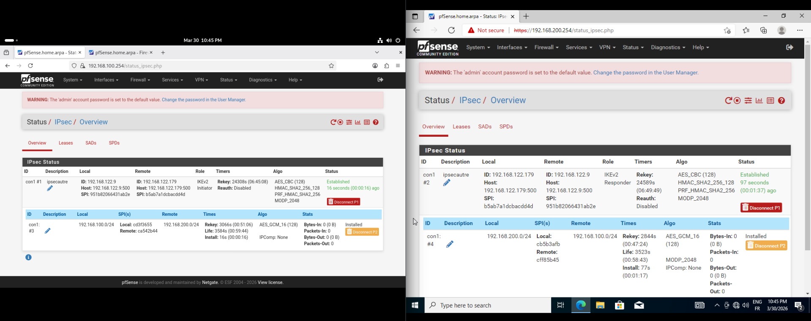

# Rapport Final – Projet Réseau TechNova

**Équipe : Mohamed & Axel – B1-A**
**Date : 2026-03-27**

---

## Table des matières

1. [Présentation de l'entreprise](#1-présentation-de-lentreprise)
2. [Analyse des besoins](#2-analyse-des-besoins-de-lentreprise)
3. [Architecture réseau](#3-description-de-larchitecture-réseau)
4. [Configurations appliquées](#4-configurations-appliquées)
5. [Scripts d'automatisation](#5-scripts-dautomatisation)
6. [Outils d'administration et monitoring](#6-outils-dadministration-et-de-monitoring)
7. [Mesures de sécurité](#7-mesures-de-sécurité-mises-en-place)
8. [Techniques d'optimisation](#8-techniques-doptimisation)
9. [IPSec — Tunneling et Chiffrage de bout en bout](#9-ipsec--tunneling-et-chiffrage-de-bout-en-bout)
10. [Implémentation Cisco Packet Tracer 9.0](#10-implémentation-cisco-packet-tracer-90)

---

## 1. Présentation de l'entreprise

TechNova est une entreprise spécialisée dans la production d'écrans et de matériel technologique. En pleine expansion, elle dispose de deux sites principaux :

- **Le siège social**, regroupant :
  - Recherche & Développement (R&D)
  - Ressources Humaines (RH)
  - Finance et Comptabilité
  - Service Juridique
- **L'agence de Paris**, comprenant :
  - Logistique et Supply Chain
  - Production
  - Contrôle Qualité
  - Marketing

L'entreprise compte plus de **300 employés**, répartis entre ces deux sites. Cette structure nécessite un réseau fiable, sécurisé et évolutif.

---

## 2. Analyse des besoins de l'entreprise

### 2.1 Sécurité des données

Chaque département manipule des données sensibles (financières, juridiques, techniques). Il est donc nécessaire de :

- **Segmenter le réseau** pour isoler les services
- Limiter les communications non autorisées
- Respecter les réglementations comme le RGPD

### 2.2 Communication interne contrôlée

Malgré l'isolation, certains services doivent communiquer :

- Accès aux serveurs (fichiers, DNS, DHCP, FTP)
- Accès aux ressources partagées
- Accès à Internet (selon département)

### 2.3 Haute disponibilité

Le réseau doit garantir :

- Une **continuité de service**
- Une tolérance aux pannes (routeurs redondants, double sortie WAN)
- Une stabilité pour tous les utilisateurs

### 2.4 Gestion automatisée

Avec plus de 300 employés :

- Attribution automatique des adresses IP (DHCP centralisé)
- Résolution de noms interne (DNS — domaine `technova.local`)
- Administration simplifiée et sauvegardes automatiques

---

## 3. Description de l'architecture réseau

### 3.1 Topologie générale

Le réseau est simulé sous **GNS3** avec une topologie en maillage partiel comprenant **5 routeurs Cisco IOS-XE** (CSR1000v / Catalyst 8000v), des **switches Cisco IOSvL2**, et **2 pare-feux pfSense** pour la redondance WAN.

La topologie "Bis" adoptée offre :
- **Double sortie WAN** (pfSense 2.5.2-1 via R1_bis, pfSense 2.5.2-4 via R5_bis)
- **Pivot central** R3_bis interconnectant toutes les zones
- **Redondance des passerelles** sur la zone Serveurs
- **Chemins alternatifs OSPF** pour la convergence rapide

### 3.2 Plan d'adressage

#### Réseaux d'extrémité (VLANs)

| Zone | Réseau | Passerelle | Routeur |
|------|--------|-----------|---------|
| Salle des serveurs (Vert) | 192.168.10.0/24 | .254 | R2_bis (principal), R3_bis, R4_bis |
| Marketing (Rouge) | 192.168.20.0/24 | .254 | R1_bis |
| Contrôle Qualité (Bleu) | 192.168.30.0/24 | .254 | R5_bis (principal), R3_bis (.253) |
| Production (Rose) | 192.168.40.0/24 | .254 | R4_bis |
| Logistique (Jaune) | 192.168.50.0/24 | .254 | R4_bis |

#### Liaisons inter-routeurs (point à point /30)

| Liaison | Réseau | R-gauche | R-droite |
|---------|--------|----------|----------|
| R1_bis ↔ R2_bis | 10.0.4.0/30 | .1 (Gi0/0) | .2 (Gi0/0) |
| R1_bis ↔ R5_bis | 10.0.6.0/30 | .1 (Gi0/1) | .2 (Gi0/0) |
| R2_bis ↔ R3_bis | 10.0.2.0/30 | .1 (Gi0/1) | .2 (Gi0/1) |
| R3_bis ↔ R4_bis | 10.0.1.0/30 | .1 (Gi0/0) | .2 (Gi0/0) |
| R1_bis ↔ pfSense 2.5.2-1 | 203.0.114.0/30 | .1 (Gi0/3) | — |
| R5_bis ↔ pfSense 2.5.2-4 | 203.0.113.0/30 | .1 (Gi0/1) | .2 (FAI) |

### 3.3 Détail des routeurs

#### R1_bis — Passerelle Siège Paris

Gère l'accès Marketing et la sortie WAN principale via pfSense 2.5.2-1.

```
Interface              IP              Rôle
GigabitEthernet0/0     10.0.4.1        Lien vers R2_bis
GigabitEthernet0/1     10.0.6.1        Lien vers R5_bis
GigabitEthernet0/2     192.168.20.254  Passerelle VLAN Marketing
GigabitEthernet0/3     203.0.114.1     Lien vers pfSense 2.5.2-1 (WAN principal)
```


#### R2_bis — Passerelle Zone Serveurs

Point d'entrée principal pour les serveurs DHCP/DNS.

```
Interface              IP              Rôle
GigabitEthernet0/0     10.0.4.2        Lien vers R1_bis
GigabitEthernet0/1     10.0.2.1        Lien vers R3_bis
GigabitEthernet0/2     192.168.10.254  Passerelle VLAN Serveurs
```


#### R3_bis — Pivot Central

Hub d'interconnexion majeur. Relie toutes les zones entre elles.

```
Interface              IP              Rôle
GigabitEthernet0/0     10.0.1.1        Lien vers R4_bis
GigabitEthernet0/1     10.0.2.2        Lien vers R2_bis
GigabitEthernet0/2     192.168.30.253  Passerelle VLAN Contrôle Qualité (secondaire)
```


#### R4_bis — Passerelle Sites Distants

Gère les zones Production et Logistique du site Paris.

```
Interface              IP              Rôle
GigabitEthernet0/0     10.0.1.2        Lien vers R3_bis
GigabitEthernet0/1     192.168.40.254  Passerelle VLAN Production
GigabitEthernet0/2     192.168.10.253  Zone Serveurs (passerelle secondaire)
```

> Note : En GNS3 R4_bis gérait aussi le VLAN Logistique (192.168.50.254). En PT cette interface est absente (limitation 3 ports du 2911).


#### R5_bis — Sortie WAN 2

Assure la redondance WAN via pfSense 2.5.2-4 et partage la passerelle Contrôle Qualité avec R3_bis.

```
Interface              IP              Rôle
GigabitEthernet0/0     10.0.6.2        Lien vers R1_bis
GigabitEthernet0/1     203.0.113.1     Lien vers pfSense 2.5.2-4 (WAN redondant)
GigabitEthernet0/2     192.168.30.254  Passerelle VLAN Contrôle Qualité (principal)
```


### 3.4 Services réseau

Un **réseau serveur dédié** a été mis en place (VLAN Serveurs 192.168.10.0/24), comprenant :

| Serveur | IP | Rôle |
|---------|-----|------|
| SRV_DHCP | 192.168.10.1 | Attribution automatique des IPs par zone (scopes par VLAN) |
| SRV_DNS | 192.168.10.2 | Résolution des noms internes — domaine `technova.local` |
| SRV_Misc | 192.168.10.3 | Serveur FTP partagé (accessible à tous sauf Production) |

### 3.5 Haute disponibilité et redondance

L'architecture intègre plusieurs mécanismes :

- **Double sortie WAN** : si pfSense1 tombe, pfSense4 (R5_bis) prend le relais automatiquement via OSPF
- **Pivot central R3_bis** : tout le trafic inter-zones peut transiter par lui si un lien direct tombe
- **OSPF** : convergence rapide vers le meilleur chemin en cas de panne, sans intervention manuelle
- **Double passerelle CQ** : R5_bis (.254) et R3_bis (.253) peuvent tous deux servir de gateway pour 192.168.30.0/24

---

## 4. Configurations appliquées

### 4.1 Configuration OSPF (Routage dynamique)

Le protocole **OSPF (Open Shortest Path First)** est utilisé en zone unique (area 0) sur tous les routeurs. Il calcule automatiquement les meilleurs chemins et reconverge en quelques secondes en cas de panne.

#### R1_bis

```ios
router ospf 1
 router-id 1.1.1.1
 network 192.168.20.0 0.0.0.255 area 0
 network 10.0.6.0 0.0.0.3 area 0
 network 10.0.3.0 0.0.0.3 area 0
 network 203.0.114.0 0.0.0.3 area 0
 network 10.0.4.0 0.0.0.3 area 0
 default-information originate
```

#### R2_bis

```ios
router ospf 1
 router-id 2.2.2.2
 network 192.168.10.0 0.0.0.255 area 0
 network 192.168.20.0 0.0.0.255 area 0
 network 10.0.4.0 0.0.0.3 area 0
 network 10.0.2.0 0.0.0.3 area 0
```

#### R3_bis

```ios
router ospf 1
 router-id 3.3.3.3
 network 10.0.3.0 0.0.0.3 area 0
 network 10.0.2.0 0.0.0.3 area 0
 network 10.0.1.0 0.0.0.3 area 0
 network 10.0.5.0 0.0.0.3 area 0
 network 192.168.10.0 0.0.0.255 area 0
 network 192.168.30.0 0.0.0.255 area 0
```


#### R4_bis

```ios
router ospf 1
 router-id 4.4.4.4
 network 10.0.1.0 0.0.0.3 area 0
 network 192.168.50.0 0.0.0.255 area 0
 network 192.168.40.0 0.0.0.255 area 0
 network 192.168.10.0 0.0.0.255 area 0
```

#### R5_bis

```ios
router ospf 1
 router-id 5.5.5.5
 network 10.0.6.0 0.0.0.3 area 0
 network 10.0.5.0 0.0.0.3 area 0
 network 203.0.113.0 0.0.0.3 area 0
 network 192.168.30.0 0.0.0.255 area 0
 default-information originate
```


**Vérification de la convergence OSPF** (adjacence R1_bis ↔ R5_bis) :


### 4.2 Configuration VLAN (Switches)

Les switches Cisco IOSvL2 segmentent le réseau par département.

#### Switch Contrôle Qualité (CiscoIOSvL2-2)

```ios
vlan 30
 name Controle_Qualite

interface GigabitEthernet0/0
 switchport trunk encapsulation dot1q
 switchport mode trunk
 switchport trunk allowed vlan 30

interface GigabitEthernet0/1
 switchport trunk encapsulation dot1q
 switchport mode trunk
 switchport trunk allowed vlan 30

interface GigabitEthernet0/2
 switchport mode access
 switchport access vlan 30

interface GigabitEthernet1/0
 switchport mode access
 switchport access vlan 30
```


**Vérification des trunks :**


Les ports Gi0/0 (→ R5_bis) et Gi0/1 (→ R3_bis) sont en mode trunk 802.1Q, autorisant le VLAN 40.

### 4.3 ACLs – Mesures de sécurité réseau

Plusieurs ACLs ont été mises en place pour isoler les VLANs et contrôler les accès. La protection WAN est assurée par pfSense — les ACLs couvrent uniquement la politique de trafic interne.

#### ACL Production — isolée, sans FTP, sans Internet (R4_bis)

**Cas d'usage :** La Production n'a accès à aucun autre département, ne peut pas utiliser le FTP, et n'a pas accès à Internet. Seuls DHCP/DNS sont autorisés.

```ios
ip access-list extended ACL_PROD_VERS_SERV
 permit udp any host 255.255.255.255 eq 67   ! DHCP broadcast
 permit udp any host 192.168.10.254 eq 67    ! DHCP unicast
 permit udp any host 192.168.10.254 eq 68    ! DHCP réponse
 permit udp any host 192.168.10.254 eq 53    ! DNS (UDP)
 permit tcp any host 192.168.10.254 eq 53    ! DNS (TCP)
 deny   tcp any host 192.168.10.3 eq 21      ! Bloquer FTP contrôle
 deny   tcp any host 192.168.10.3 eq 20      ! Bloquer FTP data
 deny   ip any 192.168.0.0 0.0.255.255       ! Bloquer tous les VLANs internes
 deny   ip any any                            ! Bloquer Internet

interface GigabitEthernet0/1
 ip access-group ACL_PROD_VERS_SERV in
```

**Vérification — `show ip access-lists ACL_PROD_VERS_SERV` :**

```
R4_bis#show ip access-lists ACL_PROD_VERS_SERV
Extended IP access list ACL_PROD_VERS_SERV
    permit udp any host 192.168.10.254 eq bootps
    permit udp any host 192.168.10.254 eq bootpc
    permit udp any host 192.168.10.254 eq domain
    permit tcp any host 192.168.10.254 eq domain
    deny tcp any host 192.168.10.3 eq ftp
    deny tcp any host 192.168.10.3 eq 20
    deny ip any 192.168.0.0 0.0.255.255
    deny ip any any
```

#### ACL Marketing — accès Serveurs + Internet, isolée des autres VLANs (R1_bis:Gi0/2)

```ios
ip access-list extended ACL_MARKETING
 permit udp any host 192.168.10.254 eq 67
 permit udp any host 192.168.10.254 eq 68
 permit udp any host 192.168.10.254 eq 53
 permit tcp any host 192.168.10.254 eq 53
 permit ip any 192.168.10.0 0.0.0.255        ! Accès à la zone Serveurs (FTP, etc.)
 deny   ip any 192.168.0.0 0.0.255.255       ! Bloquer les autres VLANs
 permit ip any any                            ! Autoriser Internet

interface GigabitEthernet0/2
 ip access-group ACL_MARKETING in
```

**Vérification — `show ip access-lists ACL_MARKETING` :**

```
R1_bis#show ip access-lists ACL_MARKETING
Extended IP access list ACL_MARKETING
    permit udp any host 192.168.10.254 eq bootps
    permit udp any host 192.168.10.254 eq bootpc
    permit udp any host 192.168.10.254 eq domain
    permit tcp any host 192.168.10.254 eq domain
    permit ip any 192.168.10.0 0.0.0.255
    deny ip any 192.168.0.0 0.0.255.255
    permit ip any any
```

#### ACL CQ — accès Serveurs + Internet, isolée des autres VLANs (R5_bis:Gi0/2 et R3_bis:Gi0/2)

```ios
ip access-list extended ACL_CQ
 permit udp any host 192.168.10.254 eq 67
 permit udp any host 192.168.10.254 eq 68
 permit udp any host 192.168.10.254 eq 53
 permit tcp any host 192.168.10.254 eq 53
 permit ip any 192.168.10.0 0.0.0.255        ! Accès à la zone Serveurs
 deny   ip any 192.168.0.0 0.0.255.255       ! Bloquer les autres VLANs
 permit ip any any                            ! Autoriser Internet

interface GigabitEthernet0/2
 ip access-group ACL_CQ in
```

**Vérification — `show ip access-lists ACL_CQ` :**

```
R5_bis#show ip access-lists ACL_CQ
Extended IP access list ACL_CQ
    permit udp any host 192.168.10.254 eq bootps
    permit udp any host 192.168.10.254 eq bootpc
    permit udp any host 192.168.10.254 eq domain
    permit tcp any host 192.168.10.254 eq domain
    permit ip any 192.168.10.0 0.0.0.255
    deny ip any 192.168.0.0 0.0.255.255
    permit ip any any
```

**Synthèse des politiques d'accès par VLAN :**

| VLAN | Serveurs | FTP (SRV_Misc) | Autres VLANs | Internet |
|------|----------|----------------|--------------|----------|
| Marketing | ✅ | ✅ | ❌ | ✅ |
| Contrôle Qualité | ✅ | ✅ | ❌ | ✅ |
| Production | DHCP/DNS seulement | ❌ | ❌ | ❌ |
| Serveurs | — | — | ✅ tout | ✅ |

#### ACL Administration SSH (tous les routeurs)

**Cas d'usage :** Seuls les admins de la zone Serveurs peuvent se connecter aux routeurs. Telnet est interdit — le mot de passe circulerait en clair.

```ios
ip access-list standard ACL_ADMIN
 permit 192.168.10.0 0.0.0.255
 deny any log

line vty 0 4
 access-class ACL_ADMIN in
 transport input ssh
 login local
```

**Vérification — `show ip access-lists ACL_ADMIN` :**

```
R1_bis#show ip access-lists ACL_ADMIN
Standard IP access list ACL_ADMIN
    permit 192.168.10.0 0.0.0.255
    deny any log
```

### 4.4 Pare-feu pfSense

Deux instances pfSense 2.5.2 assurent la sécurité périmétrique :

- **pfSense 2.5.2-1** (lié à R1_bis:Gi0/3, 203.0.114.0/30 — R1_bis = 203.0.114.1) : sortie WAN principale du siège Paris
- **pfSense 2.5.2-4** (lié à R5_bis:Gi0/1, 203.0.113.0/30 — R5_bis = 203.0.113.1) : sortie WAN de secours

Chaque pfSense applique :
- Filtrage du trafic entrant/sortant (stateful firewall)
- NAT pour les adresses internes
- Protection contre les attaques périmètriques (scans, DDoS)


---

## 5. Scripts d'automatisation

### Script `back_up.py` — Sauvegarde automatique des configurations

Un script Python a été développé pour automatiser la sauvegarde périodique de toutes les configurations des équipements actifs dans GNS3.

**Fonctionnement :**

1. **Récupération des nœuds** : interroge l'API REST GNS3 (`http://192.168.212.175/v2/`) pour lister tous les équipements du projet
2. **Détection du type** : détermine si l'équipement est un routeur ou un switch pour adapter les commandes
3. **Connexion console** : se connecte via socket TCP au port console GNS3 de chaque équipement actif
4. **Collecte des données** :
   - `show running-config` — configuration complète
   - `show ip interface brief` — état des interfaces (routeurs)
   - `show ip route` — table de routage (routeurs)
   - `show vlan brief` + `show interfaces trunk` (switches)
5. **Sauvegarde horodatée** : chaque cycle crée un dossier `configs/YYYYMMDD_HHMMSS/` contenant un fichier par équipement
6. **Rotation automatique** : le backup JSON précédent est archivé dans `backups/` avant chaque cycle
7. **Cycle toutes les 30 minutes** : exécution continue sans intervention manuelle

```python
# Extrait — détection du type d'équipement
def detect_device_type(node):
    name = node.get("name", "").lower()
    if "router" in node.get("node_type","") or name.startswith("r"):
        return "router"
    elif "switch" in node.get("node_type","") or name.startswith("sw"):
        return "switch"
    return "default"
```

**Avantages :**
- Traçabilité complète de l'évolution des configurations
- Restauration rapide en cas d'erreur de configuration
- Aucune intervention manuelle requise

---

## 6. Outils d'administration et de monitoring

| Outil | Rôle |
|-------|------|
| **GNS3** | Simulation de la topologie, console des équipements, gestion des liens |
| **API REST GNS3** | Automatisation (start/stop/reload des nœuds, récupération des ports console) |
| **Console GNS3 / SSH** | Configuration directe des équipements Cisco IOS-XE (Telnet interdit) |
| **pfSense WebGUI** | Administration des règles firewall, monitoring du trafic WAN |
| **Script `back_up.py`** | Sauvegarde automatique toutes les 30 minutes |
| **Cisco Packet Tracer 9.0** | Simulation et validation des configurations en environnement pédagogique |

**Commandes de diagnostic utilisées régulièrement :**

```ios
! OSPF
show ip ospf neighbor
show ip ospf neighbor detail
show ip ospf database

! Routage
show ip route
show ip route ospf

! Interfaces
show ip interface brief
show interfaces <int> counters errors

! ACL
show ip access-lists
clear ip access-list counters

! NAT
show ip nat translations
show ip nat statistics

! VLAN (switches)
show vlan brief
show interfaces trunk
```

---

## 7. Mesures de sécurité mises en place

### 7.1 Synthèse des protections

| Couche | Mesure | Équipements concernés |
|--------|--------|----------------------|
| Périmètre WAN | pfSense (NAT + firewall stateful) | R1_bis↔pfSense1, R5_bis↔pfSense4 |
| Segmentation L2 | VLANs par département (isolation broadcast) | Tous switches |
| Isolation Production | ACL_PROD_VERS_SERV (DHCP/DNS only, FTP bloqué, VLANs bloqués, Internet bloqué) | R4_bis Gi0/1 |
| Isolation Marketing | ACL_MARKETING (Serveurs autorisé, autres VLANs bloqués) | R1_bis Gi0/2 |
| Isolation CQ | ACL_CQ (Serveurs autorisé, autres VLANs bloqués) | R5_bis Gi0/2 + R3_bis Gi0/2 |
| Administration | ACL_ADMIN + SSH uniquement, Telnet désactivé | Tous routeurs VTY |

### 7.2 Principe de défense en profondeur

L'architecture suit le principe de **défense en profondeur** :

1. **Couche 1 – Périmètre WAN** : pfSense filtre et fait du NAT — le trafic Internet non sollicité n'entre jamais
2. **Couche 2 – Segmentation L2** : les VLANs isolent chaque département au niveau du switch
3. **Couche 3 – Politique interne** : ACLs contrôlent précisément ce que chaque VLAN peut atteindre
4. **Couche 4 – Administration** : Telnet interdit, SSH restreint aux seuls admins de la zone Serveurs

> La protection WAN est délibérément laissée à pfSense qui est dimensionné pour ça. Chaque équipement a un rôle clair.

---

## 8. Techniques d'optimisation

### 8.1 OSPF – Convergence rapide

- **Router-ID explicites** (1.1.1.1 à 5.5.5.5) : évite les réélections de DR/BDR lors des redémarrages
- **Liens /30 entre routeurs** : minimise la taille des sous-réseaux inter-routeurs, réduit les tables OSPF
- **`default-information originate`** sur R1_bis et R5_bis : propagation automatique de la route par défaut
- **Area 0 unique** : simplifie le design, évite la complexité multi-area

### 8.2 Redondance et basculement automatique

- **Double chemin vers les serveurs** : R2_bis (principal, .254) et R4_bis (secondaire, .253) ont une interface sur 192.168.10.0/24
- **Double WAN** : si R1_bis perd sa connexion pfSense, le trafic Internet passe par R5_bis
- **Double passerelle CQ** : R3_bis (.253) et R5_bis (.254) peuvent tous deux servir de gateway

### 8.3 Sous-réseaux optimisés

L'utilisation de **/30** pour tous les liens inter-routeurs permet de :
- Réduire le gaspillage d'adresses IP
- Limiter la surface de broadcast sur les liaisons point à point
- Faciliter le filtrage dans les ACLs (wildcards précis)

---

## 9. IPSec — Tunneling et Chiffrage de bout en bout

Pour la partie firewall, nous avons opté pour une redondance avec des firewalls en croix qui permetteront de créer une infrastructure IPSec entre les deux sites.

Avec une partie WAN pour la jonction et LAN pour l'utilisation en entreprise, cette technologie est efficace pour l'optimisation et la sécurité (Partie autorisations du Firewall).

De plus, deux clients non connectés directement au réseau qui peuvent communiquer entre eux accroît la sécurité de l'entreprise.

### Sécurité et optimisations

Cette technologie est particulièrement efficace pour l'optimisation des flux et de la sécurité. Grâce au moteur de filtrage du pare-feu pfSense, nous pouvons définir des politiques d'accès strictes (ACL) pour n'autoriser que les protocoles nécessaires (ex : ICMP pour le diagnostic, HTTPS pour les applications).

**Avantages de l'isolation**

Le fait de permettre à deux clients, initialement non connectés directement, de communiquer de manière transparente via un tunnel chiffré accroît considérablement la sécurité périmétrique. L'absence d'exposition directe sur l'Internet public pour ces segments LAN réduit drastiquement la surface d'attaque de l'entreprise.

### Détails de construction

| Paramètre | pfSense 1 | pfSense 2 |
|-----------|-----------|-----------|
| WAN | 192.168.122.9/24 | 192.168.122.127/24 |
| LAN | 192.168.100.254/24 | 192.168.200.254/24 |
| Hashage | SHA256 | SHA256 |
| Protocole | ESP (AES-GCM 128) | ESP (AES-GCM 128) |
| Chiffrement Phase 1 | AES-CBC 128 / HMAC-SHA256 | AES-CBC 128 / HMAC-SHA256 |
| DH Group | MODP_2048 | MODP_2048 |
| IKE | IKEv2 | IKEv2 (Responder) |

**Statut IPSec — les deux tunnels établis :**



Le statut **Established** sur les deux pfSense confirme que les tunnels IKEv2 sont actifs et que le trafic inter-sites transite bien de façon chiffrée.

---

## 10. Implémentation Cisco Packet Tracer 9.0

### 10.1 Mapping des interfaces PT

| Routeur | Interface PT | IP | Connecté à |
|---------|-------------|-----|-----------|
| R1_bis | Gi0/0 | 10.0.4.1/30 | R2_bis:Gi0/0 |
| R1_bis | Gi0/1 | 10.0.6.1/30 | R5_bis:Gi0/0 |
| R1_bis | Gi0/2 | 192.168.20.254/24 | SW_Marketing |
| R2_bis | Gi0/0 | 10.0.4.2/30 | R1_bis:Gi0/0 |
| R2_bis | Gi0/1 | 10.0.2.1/30 | R3_bis:Gi0/1 |
| R2_bis | Gi0/2 | 192.168.10.254/24 | SW_Serveurs:Gi0/1 |
| R3_bis | Gi0/0 | 10.0.1.1/30 | R4_bis:Gi0/0 |
| R3_bis | Gi0/1 | 10.0.2.2/30 | R2_bis:Gi0/1 |
| R3_bis | Gi0/2 | 192.168.30.253/24 | SW_CQ:Gi0/1 |
| R4_bis | Gi0/0 | 10.0.1.2/30 | R3_bis:Gi0/0 |
| R4_bis | Gi0/1 | 192.168.40.254/24 | SW_Production:Gi0/1 |
| R4_bis | Gi0/2 | 192.168.10.253/24 | SW_Serveurs:Gi0/2 |
| R5_bis | Gi0/0 | 10.0.6.2/30 | R1_bis:Gi0/1 |
| R5_bis | Gi0/1 | 203.0.113.1/30 | FAI_Router:Gi0/0/0 |
| R5_bis | Gi0/2 | 192.168.30.254/24 | SW_CQ:Gi0/2 |

### 10.2 Commandes OSPF — Packet Tracer

#### R1_bis

```ios
interface GigabitEthernet0/0
 ip address 10.0.4.1 255.255.255.252
 no shutdown
interface GigabitEthernet0/1
 ip address 10.0.6.1 255.255.255.252
 no shutdown
interface GigabitEthernet0/2
 ip address 192.168.20.254 255.255.255.0
 no shutdown
 ip helper-address 192.168.10.1
router ospf 1
 router-id 1.1.1.1
 network 10.0.4.0 0.0.0.3 area 0
 network 10.0.6.0 0.0.0.3 area 0
 network 192.168.20.0 0.0.0.255 area 0
```

#### R2_bis

```ios
interface GigabitEthernet0/0
 ip address 10.0.4.2 255.255.255.252
 no shutdown
interface GigabitEthernet0/1
 ip address 10.0.2.1 255.255.255.252
 no shutdown
interface GigabitEthernet0/2
 ip address 192.168.10.254 255.255.255.0
 no shutdown
router ospf 1
 router-id 2.2.2.2
 network 10.0.4.0 0.0.0.3 area 0
 network 10.0.2.0 0.0.0.3 area 0
 network 192.168.10.0 0.0.0.255 area 0
```

#### R3_bis

```ios
interface GigabitEthernet0/0
 ip address 10.0.1.1 255.255.255.252
 no shutdown
interface GigabitEthernet0/1
 ip address 10.0.2.2 255.255.255.252
 no shutdown
interface GigabitEthernet0/2
 ip address 192.168.30.253 255.255.255.0
 no shutdown
 ip helper-address 192.168.10.1
router ospf 1
 router-id 3.3.3.3
 network 10.0.1.0 0.0.0.3 area 0
 network 10.0.2.0 0.0.0.3 area 0
 network 192.168.30.0 0.0.0.255 area 0
```

#### R4_bis

```ios
interface GigabitEthernet0/0
 ip address 10.0.1.2 255.255.255.252
 no shutdown
interface GigabitEthernet0/1
 ip address 192.168.40.254 255.255.255.0
 no shutdown
 ip helper-address 192.168.10.1
interface GigabitEthernet0/2
 ip address 192.168.10.253 255.255.255.0
 no shutdown
router ospf 1
 router-id 4.4.4.4
 network 10.0.1.0 0.0.0.3 area 0
 network 192.168.40.0 0.0.0.255 area 0
 network 192.168.10.0 0.0.0.255 area 0
```

#### R5_bis

```ios
interface GigabitEthernet0/0
 ip address 10.0.6.2 255.255.255.252
 no shutdown
interface GigabitEthernet0/1
 ip address 203.0.113.1 255.255.255.252
 no shutdown
interface GigabitEthernet0/2
 ip address 192.168.30.254 255.255.255.0
 no shutdown
 ip helper-address 192.168.10.1
ip route 0.0.0.0 0.0.0.0 203.0.113.2
router ospf 1
 router-id 5.5.5.5
 network 10.0.6.0 0.0.0.3 area 0
 network 192.168.30.0 0.0.0.255 area 0
 default-information originate
```

### 10.3 Configuration VLAN Packet Tracer

Les switches 2960-24TT en PT ne supportent pas `encapsulation dot1q`. L'uplink vers le routeur est configuré en **access** dans le même VLAN que les PCs.

#### SW_CQ (VLAN 30 — Contrôle Qualité)

```ios
vlan 30
 name Controle_Qualite
interface range FastEthernet0/1-24
 switchport mode access
 switchport access vlan 30
interface GigabitEthernet0/1
 switchport mode access
 switchport access vlan 30
interface GigabitEthernet0/2
 switchport mode access
 switchport access vlan 30
```

#### SW_Serveurs (VLAN 10)

```ios
vlan 10
 name Serveurs
interface range FastEthernet0/1-24
 switchport mode access
 switchport access vlan 10
interface GigabitEthernet0/1
 switchport mode access
 switchport access vlan 10
interface GigabitEthernet0/2
 switchport mode access
 switchport access vlan 10
```

#### SW_Production (VLAN 40)

```ios
vlan 40
 name Production
interface range FastEthernet0/1-24
 switchport mode access
 switchport access vlan 40
interface GigabitEthernet0/1
 switchport mode access
 switchport access vlan 40
```

#### SW_Marketing (VLAN 20)

```ios
vlan 20
 name Marketing
interface range FastEthernet0/1-24
 switchport mode access
 switchport access vlan 20
interface GigabitEthernet0/1
 switchport mode access
 switchport access vlan 20
```

### 10.4 ACLs Packet Tracer

Voir section [4.3](#43-acls--mesures-de-sécurité-réseau) pour le détail complet des ACLs.

### 10.5 DHCP relay (ip helper-address)

SRV_DHCP (192.168.10.1) centralise tous les pools. Les routeurs relayent les requêtes DHCP.

**Configuration SRV_DHCP (Server-PT → Services → DHCP) :**

| Pool | Default GW | Start IP | DNS | Masque |
|------|-----------|----------|-----|--------|
| VLAN10_Serveurs | 192.168.10.254 | 192.168.10.10 | 192.168.10.2 | 255.255.255.0 |
| VLAN20_Marketing | 192.168.20.254 | 192.168.20.10 | 192.168.10.2 | 255.255.255.0 |
| VLAN30_CQ | 192.168.30.254 | 192.168.30.10 | 192.168.10.2 | 255.255.255.0 |
| VLAN40_Production | 192.168.40.254 | 192.168.40.10 | 192.168.10.2 | 255.255.255.0 |

### 10.6 NAT/PAT — Accès Internet (R5_bis)

```ios
ip access-list standard NAT_INSIDE
 permit 192.168.10.0 0.0.0.255
 permit 192.168.20.0 0.0.0.255
 permit 192.168.30.0 0.0.0.255
 permit 192.168.40.0 0.0.0.255
 permit 192.168.50.0 0.0.0.255

interface GigabitEthernet0/0
 ip nat inside
interface GigabitEthernet0/1
 ip nat outside
interface GigabitEthernet0/2
 ip nat inside

ip nat inside source list NAT_INSIDE interface GigabitEthernet0/1 overload
```

**FAI_Router (simuler Internet) :**

```ios
interface GigabitEthernet0/0/0
 ip address 203.0.113.2 255.255.255.252
 no shutdown
interface Loopback0
 ip address 8.8.8.8 255.255.255.255
ip route 0.0.0.0 0.0.0.0 203.0.113.1
```

### 10.7 SRV_Misc — Serveur FTP (192.168.10.3)

- IP statique : `192.168.10.3 / 255.255.255.0`, gateway `192.168.10.254`
- Service FTP : **ON** (Server-PT → Services → FTP)
- Utilisateur : `admin` / mot de passe : `admin`
- Accessible depuis : Marketing, CQ, Serveurs
- **Bloqué depuis Production** (ACL_PROD_VERS_SERV)

### 10.8 SRV_DNS — Résolution interne (192.168.10.2)

**Enregistrements DNS (Server-PT → Services → DNS) :**

| Nom | Type | Valeur |
|-----|------|--------|
| srv-dhcp.technova.local | A | 192.168.10.1 |
| srv-dns.technova.local | A | 192.168.10.2 |
| srv-misc.technova.local | A | 192.168.10.3 |
| ftp.technova.local | A | 192.168.10.3 |

### 10.9 Plan de test

| Test | Depuis | Vers | Résultat attendu |
|------|--------|------|-----------------|
| DHCP Marketing | PC Marketing | — | IP 192.168.20.x |
| DHCP CQ | PC CQ | — | IP 192.168.30.x |
| DHCP Production | PC Production | — | IP 192.168.40.x |
| Ping Serveurs | PC Marketing | 192.168.10.254 | ✅ OK |
| Ping Serveurs | PC CQ | 192.168.10.254 | ✅ OK |
| Ping Serveurs | PC Production | 192.168.10.254 | ❌ Bloqué |
| Ping CQ depuis Marketing | PC Marketing | 192.168.30.x | ❌ Bloqué |
| Ping Marketing depuis CQ | PC CQ | 192.168.20.x | ❌ Bloqué |
| FTP | PC Marketing | 192.168.10.3 | ✅ OK |
| FTP | PC Production | 192.168.10.3 | ❌ Bloqué |
| Ping Internet | PC Marketing | 8.8.8.8 | ✅ OK (via NAT) |
| Ping Internet | PC Production | 8.8.8.8 | ❌ Bloqué |
| SSH Admin | PC Serveurs | Routeur | ✅ OK |
| SSH Admin | PC Marketing | Routeur | ❌ Bloqué |


